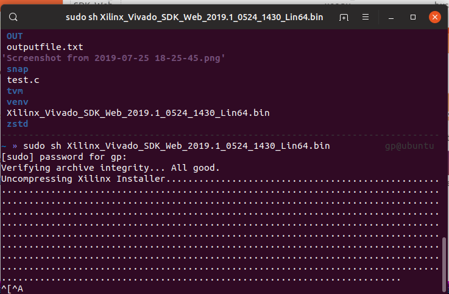
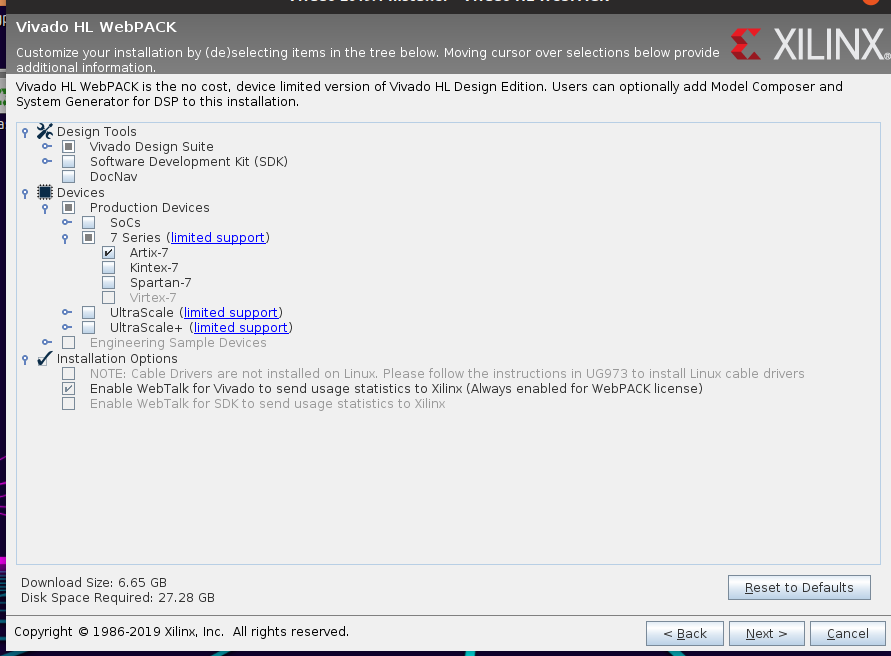

#	How to Install vivado for linux

 请先阅读[HowToInstallVivado](readme.md)

总体步骤比较类似，下好webpack(linux)后，

启动安装程序，安装vivado时，不需要sudo权限。

我这里只是图省事，毕竟在虚拟机里装的。

```shell
sudo sh Xilinx_Vivado_SDK_Web_2019.1_0524_1430_Lin64.bin
```



同样的是选择安装内容

这里注意到，相比win，这里驱动程序不能安装，所以等下还要装驱动。



