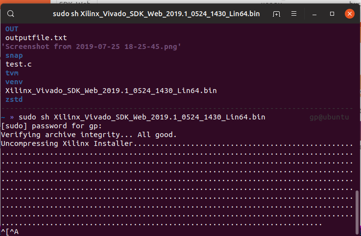
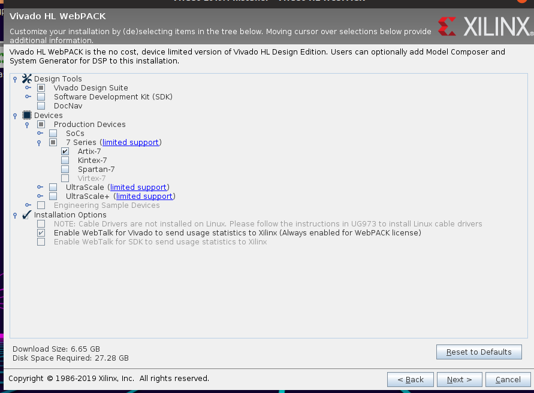
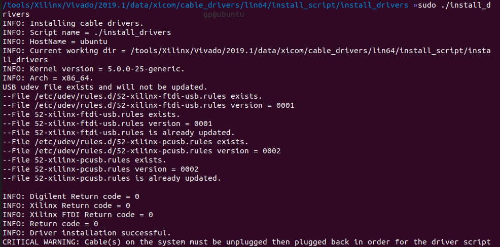

#	How to Install vivado for linux

##	install vivado

 请先阅读[HowToInstallVivado](readme.md)

总体步骤比较类似，下好webpack(linux)后，

启动安装程序，安装vivado时，不需要sudo权限。

**我这里只是图省事，毕竟在虚拟机里装的。**

```shell
sudo sh Xilinx_Vivado_SDK_Web_2019.1_0524_1430_Lin64.bin
```



同样的是选择安装内容

这里注意到，相比win，这里驱动程序不能安装，所以等下还要装驱动。



##	install driver

完成上诉操作后装驱动程序，注意这里有要sudo权限

```shell
cd /<你的安装路径>/Vivado/2019.1/data/xicom/cable_drivers/lin64/install_script/install_drivers
```

执行安装程序

```shell
sudo ./install_drivers
```



## Launch vivado

去安装目录(这是我的安装目录，你的可能跟我不一样)

```shell
cd /tools/Xilinx/Vivado/2019.1/  
```

设置环境

```shell
source settings64.sh
```

启动

```shell
vivado
```

# 写在最后

这是linux上vivado大致的安装过程。

经过测试，是可以使用的。