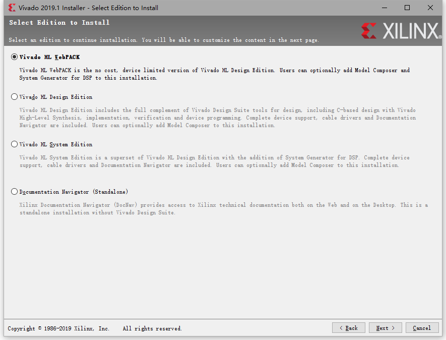

# Re:从零开始vivado安装

## 第一步：
打开[xilinx官网](https://www.xilinx.com/support/download/index.html/content/xilinx/en/downloadNav/vivado-design-tools/2019-1.html)

## 第二步：

选择你要装的版本，比如我要装的是2019.1版本的windows版，选择webpack进行安装，就是我框起来大的红框框。其他版本比如2018、2017版本类似，都选择适合自己电脑的webpack进行安装。

**有需求的用户可以下载linux版本的，目前并没有Mac版本的。**（可以尝试虚拟机或者wine解决）

## 第三步：

点击下载链接，就是要求你登录，这里我很久之前就注册过了，所以直接登录了。

如果没有账号就先注册一个。

注册链接：[https://www.xilinx.com/registration/create-account.html](https://www.xilinx.com/registration/create-account.html)

按照真实信息进行填写就可以了。**（注意用英文填写。）**

登录之后，又会要你填一个蛮复杂的表格的，这个是为了身份验证用。

**也是如实填写，注意这里也全部都要用英文填写。**

点击download就会弹出webpack的下载包。

下载完成后，双击打开webpack

##	第四步：

我们下载好webpack，就双击打开，等待一会，就会开启。

直接就**Next**（如果要加快安装速度，推荐先暂时关闭杀毒软件什么，我电脑上没有杀毒软件，所以就不管了）、

后面会叫你登录，直接用刚才的注册的帐号登录就可以。

下一步就无脑agree就行了

**其次就是最重要的一步，请选择第一个选项，只有这个是免费的。**

Next之后就是下载包的选择了，保持默认不动，参考下面的选择，去除一些选项

这里简单提下，DocNac是一些文档，SDK是软件开发工具，我们应该用不到。

随后Next就是开始下载了。**这样要强调，安装路径不要有中文，不然会安装失败的，求你们了，一定要看到这句话。**

随后install，就可以下载了，推荐到网比较好的地方下载。

耐心等吧，如果你选择装在机械硬盘里，第三步Final processing 可能会比较慢。

（如果下到一半，突然没有下载速度了，可能是你网不好，或者你杀毒软件没有关，当前正在对已经下载的包进行校验和扫描，反正没有报错就耐心等等。）（等等党终将胜利）

这里结束，软件应该是安装好了。

## 第五步 打开软件

